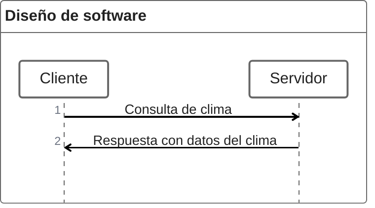

# Temp Tracker

Jorge es un entusiasta del aire libre que siempre está planeando su próxima aventura. Para ello,
quiere consultar rápidamente el clima y recibir información precisa que le permiten planificar sus
actividades con confianza.

## Requerimientos funcionales

- La página debe permitir al usuario escribir una ciudad para buscar información del clima
- La página debe mostrar al usuario la condición e imagen representativa del clima
- La página debe mostrar la temperatura, humedad y velocidad del viento

## Requerimientos no funcionales

- La página debe tener un tiempo de carga menor a 1 segundo
- Entre la búsqueda del clima y visualización de los datos debe tener una latencia máxima de 1.5
  segundos

## Diseño de software

La página web se basa en una arquitectura cliente-servidor:

## La página web se compone de los siguientes componentes principales:

1. Interfaz de usuario
2. Servicio weatherapi para obtener información del clima en tiempo real